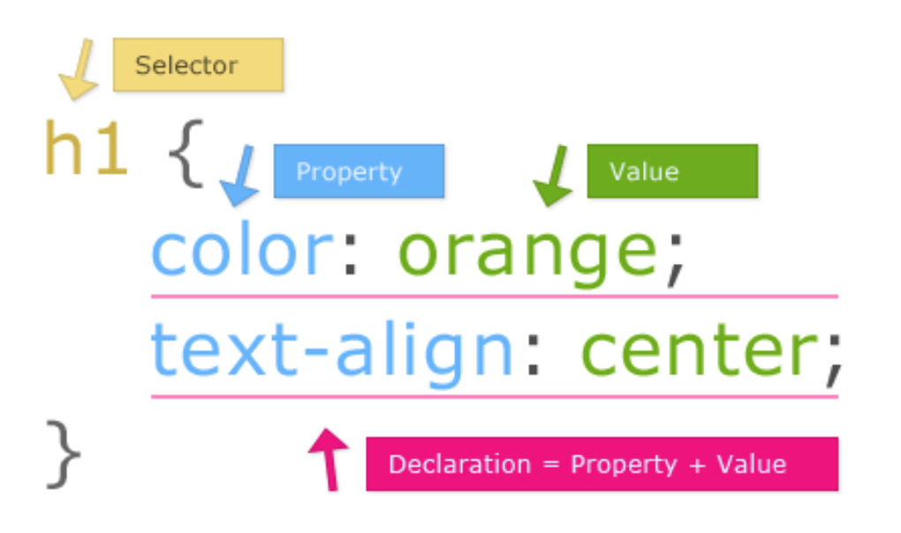

# Build a Portfolio Page

Before we start building out a portfolio page, let's talk a little bit about CSS and CDNs. We'll do a *lot* more CSS tomorrow, but let's learn a little today so that our portfolio pages can be a little more fun!

#### SWBAT (Students will be able to)

- Build a simple HTML page
- Add simple styling
- Use git and github to save progress
- Use a CDN to access a library

## Wireframe

Before we write any code, let's draw a simple wireframe for what we want our portfolio pages to look like. We'll keep it basic for now while we're working together, but you can add your own spin to it later.

## Setup

Let's create a new directory for this project! Open your terminal and navigate to your workspace.

Make a new directory and cd into it:

```bash
mkdir portfolio
```

then

```bash
cd portfolio
```

Now make an HTML file:

```bash
touch index.html
```

Open the directory in Sublime!

```bash
subl .
```

In the index file, type `html` then hit *tab*.

Add a title between the opening and closing `<title>` tags. This is what shows up in the browser tab.

Next, let's add a title inside the body. What would be a good tag to use? Type your name between the opening and closing tags.

Now, right click on the index file and click "Open in Browser." This will open your file in your default browser. For this course, Chrome is the best browser to use, so if Chrome is not your default browser, just copy the file address from the URL and open it in Chrome. If everything is working, you should see your title in the browser tab and your name in the browser window.

## Using Git

Now that we've done a little bit of work, let's set up this directory as a git repo and connect it to GitHub. This way your code will be stored on the internet and you can make commits after each major change!

```bash
git init
git add -A
git commit -m "initial commit"
```

Now let's set up the GitHub version of this repo and then connect them!

Now that we've made a commit and set up our repo, let's set up our CSS so we can add some style!

## Adding a CSS File

Go back to your terminal. Make sure your current directory is still `portfolio`. How do you check?

Make a CSS directory:

```bash
mkdir css
```

Create a CSS file in the CSS directory:

```bash
touch css/style.css
```

Now go back to Sublime. You should see your CSS directory and the file inside it in the sidebar.

In order to use this CSS file with our HTML file, we'll need to source it in. Go back to your HTML file and add a link tag to the head:

```html
<link rel="stylesheet" type="text/css" href="./css/style.css">
```

Let's add some style!

## CSS Basics

The most important thing to learn in order to get started with CSS, is how selectors work. There are many complex ways to use selectors, but we'll focus on the very basic ways for now.

CSS is used to apply style to specific elements. Which elements? That's where selectors come in. You can select all elements with a specific tag, all elements with a specific class, or a single element with a specific ID.

Here's the basic syntax:



Let's select the body of our document and add a background color. You don't have to use the same color I do; pick a color you like. [Here](http://www.w3schools.com/colors/colors_names.asp) is a list of color names supported by all browsers.

```css
body {
	background-color: hotpink;
}
```

Refresh your browser and you should see your background color change! If it didn't change, check for typos in your CSS file. 
Using our wireframe as a reference, let's add some more elements and style them as we go!

## CDN

A CDN is a content delivery network. Developers use CDN links to source in code that they want to use. For example, later this week will will use links to source in jQuery, a JavaScript library. Today, let's [go here](https://cdnjs.com/libraries/animate.css/) to source in the Animate.css library. We can use it to add some animations to our portfolio!

Let's add the link to the CDN in the head of our HTML file:

```html
<link rel="stylesheet" type="text/css" href="https://cdnjs.cloudflare.com/ajax/libs/animate.css/3.5.2/animate.min.css">
```

We can use [this documentation](https://github.com/daneden/animate.css) to figure out how to use this library. Pick your favorite animation and add it to an element on your portfolio page!

